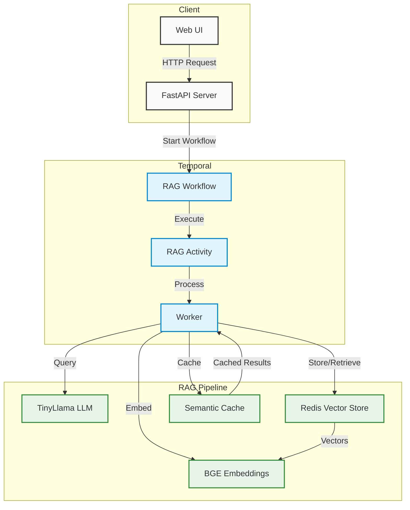

# Redis Vector Library Demo with LlamaIndex

A demonstration of using Redis as a vector store with LlamaIndex for RAG (Retrieval Augmented Generation) applications. This project showcases how to build a question-answering system using Redis Vector Library, LlamaIndex, and open-source language models, orchestrated by Temporal workflows.

## Architecture



The architecture consists of three main components:

1. **Client Layer**
   - Web UI for user interaction
   - FastAPI server handling HTTP requests

2. **Temporal Workflow Layer**
   - RAG Workflow orchestrating the process
   - RAG Activity executing the actual work
   - Worker processing the tasks

3. **RAG Pipeline Layer**
   - TinyLlama LLM for text generation
   - BGE Embeddings for text vectorization
   - Redis Vector Store for document storage
   - Semantic Cache for response optimization

## Prerequisites

- Python 3.8+
- Docker
- Git
- Temporal CLI (for local development)

## Quick Start

1. **Clone the Repository**
```bash
git clone https://github.com/yourusername/redis-vlm-demo.git
cd redis-vlm-demo
```

2. **Install Dependencies**
```bash
pip install -r requirements.txt
```

3. **Start Redis Stack**
```bash
docker run -d --name redis \
    -p 6379:6379 \
    -p 8001:8001 \
    redis/redis-stack:latest
```

4. **Start Temporal Server (Local Development)**
```bash
# Install Temporal CLI if not already installed
brew install temporal

# Start Temporal server
temporal server start-dev
```

5. **Verify Redis Connection**
```bash
redis-cli ping
# Should return PONG
```

6. **Run Data Ingestion**
```bash
python ingestion.py
```

7. **Start the Worker**
```bash
python worker.py
```

8. **Start the API Server**
```bash
uvicorn main:app --reload
```

## Project Structure

- `ingestion.py`: Handles document ingestion and vector store setup
- `agent.py`: Implements the RAG agent with LlamaIndex
- `worker.py`: Temporal worker for processing RAG queries
- `workflows/`: Contains Temporal workflow definitions
- `activities/`: Contains Temporal activity implementations
- `data/`: Directory for your documents
- `requirements.txt`: Project dependencies

## API Endpoints

### Submit a Query
```bash
curl -X POST http://localhost:8000/query \
  -H "Content-Type: application/json" \
  -d '{"query": "Your question here"}'
```

### Get Query Result
```bash
curl http://localhost:8000/query/{workflow_id}
```

### Get Query History
```bash
curl http://localhost:8000/history/{workflow_id}
```

## Verifying the Setup

### Check Redis Status
```bash
# Connect to Redis CLI
redis-cli

# List all keys
KEYS *

# Get information about the vector index
FT._LIST
FT.INFO docs

# Get document count
FT.SEARCH docs "*" LIMIT 0 0
```

### Check Temporal Status
```bash
# View Temporal server status
temporal server status

# View running workflows
temporal workflow list
```

## Components

- **Vector Store**: Redis Stack with RediSearch
- **Embedding Model**: BAAI/bge-small-en-v1.5
- **Language Model**: TinyLlama-1.1B-Chat-v1.0
- **Framework**: LlamaIndex for RAG pipeline
- **Caching**: Semantic caching for response optimization
- **Workflow Engine**: Temporal for orchestration

## Troubleshooting

### Common Issues

1. **Redis Connection Issues**
```bash
# Check if Redis container is running
docker ps | grep redis

# Restart Redis if needed
docker restart redis
```

2. **Temporal Server Issues**
```bash
# Check Temporal server status
temporal server status

# Restart Temporal server if needed
temporal server start-dev
```

3. **Port Conflicts**
```bash
# Check if ports are in use
lsof -i :6379  # Redis
lsof -i :8001  # Redis UI
lsof -i :7233  # Temporal
lsof -i :8000  # FastAPI
```

4. **Memory Issues**
- Ensure you have enough RAM for the models
- Consider using smaller models if needed

## Contributing

1. Fork the repository
2. Create your feature branch (`git checkout -b feature/amazing-feature`)
3. Commit your changes (`git commit -m 'Add some amazing feature'`)
4. Push to the branch (`git push origin feature/amazing-feature`)
5. Open a Pull Request

## License

[Add your license here]

## Acknowledgments

- Redis Stack
- LlamaIndex
- HuggingFace
- TinyLlama
- Temporal

## Coming Soon

- [ ] Architecture Diagram
- [ ] Performance Benchmarks
- [ ] Advanced Configuration Guide
- [ ] Docker Compose Setup
- [ ] Temporal Workflow Monitoring Dashboard